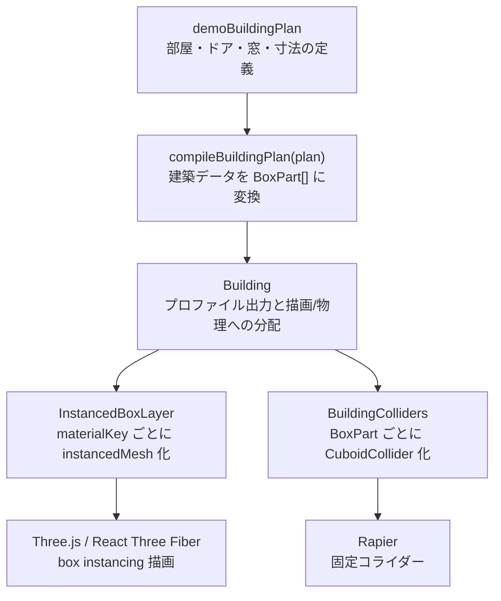

# 建物生成ワールド アーキテクチャ

このドキュメントは `xrift-building-world` のファイル構成、各ファイルのメソッド一覧、建物生成から描画・物理までの全体の流れをまとめたものです。

## 全体像

このワールドは、コードで定義した `BuildingPlan` を一度 `BoxPart[]` にコンパイルし、その `BoxPart[]` を描画と物理の両方で使う構成です。



中心になる中間表現は `BoxPart` です。床、外部地面、壁、天井、柱などはすべて box として表現されます。これにより、最終描画を `instancedMesh` にまとめやすくしています。

## ファイル構成

```txt
xrift-building-world/
  src/
    World.tsx
    dev.tsx
    index.tsx
    building/
      Building.tsx
      BuildingColliders.tsx
      InstancedBoxLayer.tsx
      compilePlan.ts
      materials.ts
      presets.ts
      types.ts
  docs/
    architecture.md
```

## ファイル別の役割とメソッド一覧

### `src/World.tsx`

ワールド本体です。XRift の `SpawnPoint`、照明、背景、`Building` を配置します。

主な定義:

- `WorldProps`
  - `position?: [number, number, number]`
  - `scale?: number`
- `World(props)`
  - `demoBuildingPlan` を `Building` に渡してワールド内に建物を配置します。
  - `SpawnPoint` で開発環境・XRift 実行時の初期位置を指定します。

### `src/dev.tsx`

ローカル開発用のエントリーポイントです。本番ビルドで公開するワールド本体ではなく、`npm run dev` 時に使われます。

主な定義:

- `rootElement`
  - `#root` DOM 要素を取得します。
- `physicsConfig`
  - `xrift.json` の `world.physics` を `DevEnvironment` に渡します。
- `cameraConfig`
  - `xrift.json` の `world.camera` を `DevEnvironment` に渡します。

処理内容:

- `XRiftProvider` に `baseUrl="/"` を設定します。
- `DevEnvironment` で `World` を包み、ローカルで移動・物理・スポーン確認できるようにします。

### `src/index.tsx`

Module Federation で公開するエクスポート定義です。

主な定義:

- `export { World } from './World'`
- `export type { WorldProps } from './World'`

### `src/building/types.ts`

建物生成の型定義を集約しています。

主な型:

- `Vec2`
  - `[number, number]`
  - XZ 平面上の 2D 座標やサイズに使います。
- `Vec3`
  - `[number, number, number]`
  - Three.js 空間上の position / size / rotation に使います。
- `WallSide`
  - `'north' | 'south' | 'east' | 'west'`
  - ドア、窓、壁生成対象の方向を表します。
- `BuildingPlan`
  - 建物全体の入力データです。
  - `floorHeight`, `wallThickness`, `slabThickness`, `rooms`, `exteriorGround` を持ちます。
- `ExteriorGroundSpec`
  - 外部地面の余白、厚み、マテリアルを指定します。
  - `BuildingPlan.exteriorGround: false` で外部地面を無効化できます。
- `RoomSpec`
  - 1 部屋の位置、サイズ、ドア、窓、マテリアル指定です。
- `OpeningSpec`
  - ドアや窓の矩形開口を表します。
  - `side`, `offset`, `width`, `height`, `bottom` を持ちます。
- `RoomMaterials`
  - 部屋単位の `floor`, `wall`, `ceiling` マテリアル指定です。
- `BoxPartKind`
  - `floor`, `exteriorGround`, `wall`, `ceiling`, `pillar`, `trim`, `colliderOnly`
- `BoxPart`
  - コンパイル後の中間表現です。
  - `id`, `kind`, `position`, `size`, `rotation`, `materialKey`, `collider` を持ちます。

### `src/building/presets.ts`

デモ用の建物定義を置いています。

主な定義:

- `demoBuildingPlan`
  - lobby、gallery、side-room の 3 部屋を定義しています。
  - 各部屋にドア、窓、床/壁マテリアルを指定しています。
  - 未指定の `exteriorGround` はデフォルト有効なので、建物の外にも床とほぼ同じ高さの地面が生成されます。

### `src/building/materials.ts`

`materialKey` から Three.js の `meshStandardMaterial` パラメータへ変換する辞書です。

主な定義:

- `MATERIALS`
  - `floor:warm-wood`
  - `floor:stone`
  - `ground:outdoor`
  - `wall:plaster`
  - `wall:gallery-white`
  - `wall:accent`
  - `ceiling:soft-white`
  - `trim:dark-metal`
  - `pillar:concrete`
- `MaterialKey`
  - `keyof typeof MATERIALS`

### `src/building/compilePlan.ts`

建物生成の中心です。`BuildingPlan` を `BoxPart[]` に変換します。壁生成、開口処理、共有壁の除去、外部地面生成、重複 box 除去を担当します。

主な定義:

- `WallSegment`
  - 壁ローカル 2D 空間上の矩形です。
  - `start`, `end`, `bottom`, `top` を持ちます。
- `DEFAULT_MATERIALS`
  - 部屋で未指定の場合の床・壁・天井マテリアルです。
- `OPENING_DEFAULTS`
  - ドアと窓のデフォルト高さ・下端位置です。
- `EPSILON`
  - 境界比較やゼロ幅除去に使う許容値です。

メソッド一覧:

- `compileBuildingPlan(plan)`
  - `BuildingPlan` から最終的な `BoxPart[]` を生成します。
  - 外部地面、各部屋、重複除去をまとめます。
- `compileExteriorGround(plan)`
  - 部屋全体の外接範囲から、外部地面 `exterior:ground` を生成します。
  - 室内床との z-fighting を避けるため、外部地面はごくわずかに下げます。
- `getRoomBounds(rooms)`
  - 複数部屋の外接矩形を計算します。
- `compileRoom(plan, room)`
  - 1 部屋から床、天井、壁、柱の `BoxPart` を生成します。
  - 共有壁はここでスキップします。
- `isSharedWallOwnedByAnotherRoom(rooms, room, side)`
  - 指定 wall が他の部屋と共有され、かつ他の部屋が所有すべきかを判定します。
- `areOppositeWallsTouching(room, side, other)`
  - 指定方向の壁が他部屋の反対側壁と接しているかを判定します。
- `getRoomBoundary(room)`
  - 部屋の `minX`, `maxX`, `minZ`, `maxZ` を返します。
- `rangesOverlap(aMin, aMax, bMin, bMax)`
  - 2 つの範囲が重なっているかを判定します。
- `nearlyEqual(a, b)`
  - `EPSILON` を使って値がほぼ等しいか判定します。
- `dedupeExactBoxParts(parts)`
  - 完全一致する box を除去します。
  - 幾何的なマージではなく、同一 box の重複削除だけを行います。
- `toDedupeKey(value)`
  - 重複判定用に数値を固定小数へ変換します。
- `normalizeOpenings(openings, side, isDoor)`
  - 指定 side の開口だけを抽出し、未指定の `bottom` / `height` にデフォルト値を補います。
- `compileWall(input)`
  - 1 面の壁を、開口処理済みの複数 `wall` box に変換します。
- `splitWallSegments(wallLength, floorHeight, openings)`
  - 壁全面の矩形からドア・窓の矩形を順に引き、残った壁矩形を返します。
- `subtractOpening(segment, opening)`
  - 1 つの壁矩形から 1 つの開口矩形を引きます。
  - 最大で左・右・下・上の 4 つの矩形が残ります。
- `wallPartPosition(side, roomX, roomZ, width, depth, centerAlongWall, centerY)`
  - 壁ローカルの中心座標を world-space の `position` に変換します。
- `wallPartSize(side, length, height, wallThickness)`
  - 壁方向に応じて box の `size` を作ります。
  - north/south は長辺を X、east/west は長辺を Z に置きます。
- `compileRoomTrim(plan, room)`
  - 部屋の 4 隅に柱 box を生成します。

### `src/building/Building.tsx`

コンパイル、プロファイル出力、描画・物理への分配を担当します。

メソッド一覧:

- `Building({ plan })`
  - `compileBuildingPlan(plan)` を `useMemo` で実行します。
  - `console.log('[building profile]', ...)` でプロファイルを出力します。
  - `InstancedBoxLayer` と `BuildingColliders` に同じ `parts` を渡します。
- `createBuildingProfile(parts)`
  - `renderInstances`, `colliderInstances`, `materialCount`, `kindCount`, `byMaterial`, `byKind` を集計します。
- `countBy(parts, getKey)`
  - `BoxPart[]` を任意キーで集計して `Map<string, number>` を返します。

### `src/building/InstancedBoxLayer.tsx`

`BoxPart[]` を `materialKey` ごとの `instancedMesh` にまとめて描画します。

主な定義:

- `InstancedBoxLayerProps`
  - `parts: BoxPart[]`
- `unitBoxGeometry`
  - すべての instance で共有する `BoxGeometry(1, 1, 1)` です。

メソッド一覧:

- `InstancedBoxLayer({ parts })`
  - `groupByMaterial(parts)` でマテリアル単位に分けます。
  - 各 material group を `InstancedBoxes` として描画します。
- `InstancedBoxes({ materialKey, parts })`
  - `InstancedMesh` に各 `BoxPart` の matrix を設定します。
  - `position`, `rotation`, `size` を `Matrix4.compose` で instance matrix に変換します。
- `groupByMaterial(parts)`
  - `BoxPart[]` を `materialKey` ごとにグループ化します。

### `src/building/BuildingColliders.tsx`

`BoxPart[]` から Rapier の固定コライダーを生成します。

メソッド一覧:

- `BuildingColliders({ parts })`
  - `RigidBody type="fixed"` の中に `CuboidCollider` を並べます。
  - `part.collider !== false` の `BoxPart` だけを対象にします。
  - `CuboidCollider.args` は `size / 2` で指定します。

## コンパイル処理の詳細

### 1. 外部地面の生成

`compileExteriorGround` は、すべての部屋の外接範囲を `getRoomBounds` で求めます。その外接範囲に `margin` を足して、建物の外に出られる大きな地面 box を生成します。

外部地面は室内床とほぼ同じ高さですが、室内床と重なる場所で z-fighting が起きないよう、Y 方向に `0.002` だけ下げています。

### 2. 部屋ごとの生成

`compileRoom` は 1 部屋につき以下を生成します。

- 床
- 天井
- 4 面の壁
- 4 隅の柱

ただし、隣の部屋と共有している壁は片側だけが生成します。これにより、同じ平面に壁 mesh / collider が重なることを防ぎます。

### 3. 壁と開口の生成

壁は最初に 1 枚の大きな矩形として考えます。ドアや窓は壁ローカル座標上の矩形開口です。

`splitWallSegments` は、壁全面の矩形から開口を順に引きます。1 つの開口を引くと、最大で次の 4 つの矩形が残ります。

- 開口の左
- 開口の右
- 開口の下
- 開口の上

残った矩形は `compileWall` で world-space の box に変換されます。CSG を使わず box 分割だけで処理するため、最終的にすべて box instancing に乗せられます。

### 4. 重複 box の除去

`dedupeExactBoxParts` は、完全一致する `BoxPart` だけを除去します。これは隣接部屋の角柱など、同じ位置・同じサイズ・同じマテリアルで生成されるものを消すためです。

壁を結合したり、部分的に重なる box を最適化したりする処理ではありません。

## 描画の流れ

`Building` から `InstancedBoxLayer` に `BoxPart[]` が渡されます。

`InstancedBoxLayer` は `materialKey` ごとに `BoxPart` をまとめます。Three.js の `InstancedMesh` は 1 つの geometry と 1 つの material を共有するため、materialKey ごとに mesh を分ける必要があります。

各 instance では以下を matrix に変換します。

- `position`
- `rotation`
- `size`

このため、同じ material の床・壁・柱などは 1 つの `instancedMesh` にまとめて描画できます。

## 物理の流れ

`Building` から `BuildingColliders` に同じ `BoxPart[]` が渡されます。

`BuildingColliders` は `part.collider !== false` のものだけを対象にして、`CuboidCollider` を生成します。天井など、物理が不要なものは `collider: false` にできます。

現状は box ごとに collider を生成しています。将来的に collider 数が増えた場合は、描画用 `BoxPart[]` とは別に、隣接 collider を結合する最適化を追加できます。

## プロファイル出力

`Building.tsx` はコンパイル後の `BoxPart[]` からプロファイルを作り、console に出力します。

```ts
console.log('[building profile]', {
  renderInstances,
  colliderInstances,
  materialCount,
  kindCount,
  byMaterial,
  byKind,
})
```

確認できること:

- 描画 instance 総数
- collider 総数
- material 数
- kind 数
- materialKey ごとの instance 数
- `floor`, `wall`, `ceiling`, `pillar`, `exteriorGround` など kind ごとの数

## 拡張方針

今後の拡張は、基本的に `BuildingPlan` の入力表現を増やし、最終的には `BoxPart[]` に落とす形を保つのがよいです。

候補:

- 廊下プリセット
- 階段
- 複数階
- 外壁専用マテリアル
- ドア枠・窓枠の trim
- collider 結合最適化
- GUI で編集した floor plan から `BuildingPlan` を生成

重要なのは、編集しやすい入力データと、描画に効率のよい `BoxPart[]` を分離し続けることです。
