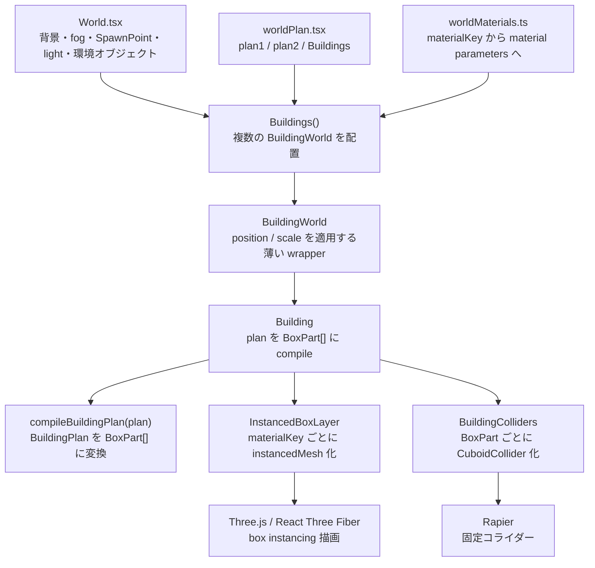

# 建物生成ワールド アーキテクチャ

このドキュメントは `xrift-building-world` の現在の実装に合わせて、建物 plan から描画・物理までの流れと、ワールド固有コードと汎用 building レイヤーの責務境界をまとめたものです。

plan の書き方はルートの `README.md` に分けています。このファイルは実装者向けの内部構造メモです。

## 全体像

このワールドは、`src/worldPlan.tsx` にある `BuildingPlan` データを `BuildingWorld` に渡し、汎用 building レイヤーで `BoxPart[]` に変換して描画と物理へ分配します。

現状のサンプル world は `plan1` と `plan2` の 2 つの plan を使い、`Buildings()` がそれぞれを別の高さに配置しています。`World.tsx` は背景、fog、地面、SpawnPoint、照明、追加の固定オブジェクトを持ち、最後に `Buildings()` を描画します。



中心になる中間表現は `BoxPart` です。床、外部地面、壁、天井、柱はすべて axis-aligned box として表現されます。これにより、描画は `InstancedMesh` にまとめやすく、物理も同じ形状データから `CuboidCollider` を生成できます。

## 責務境界

- `src/World.tsx`
  - XRift ワールドとしての背景、fog、SpawnPoint、照明、追加の固定オブジェクトを持ちます。
  - 現状の `WorldProps` は型としては `position`, `scale`, `enableProfileLog` を持ちますが、実装内ではまだ利用していません。
  - plan/material の実体は直接持たず、`Buildings()` を呼びます。
- `src/worldPlan.tsx`
  - このワールド固有の `BuildingPlan` を定義します。
  - 現状は `plan1`, `plan2`, `Buildings()` を export します。
  - `Buildings()` は `BuildingWorld` に plan、material catalog、配置、profile log 設定を渡します。
- `src/worldMaterials.ts`
  - このワールド固有の material catalog を定義します。
  - `materialKey` と Three.js `MeshStandardMaterialParameters` 相当の設定を対応させます。
  - `texture.map` は `public/` からの相対パスです。
- `src/building/`
  - 汎用 building レイヤーです。
  - plan と material catalog は呼び出し側から受け取ります。
  - ワールド固有の room preset や material catalog 実体は持ちません。

## ファイル構成

```txt
xrift-building-world/
  README.md
  public/
    textures/
      warm-wood.svg
  src/
    World.tsx
    worldPlan.tsx
    worldMaterials.ts
    dev.tsx
    index.tsx
    building/
      Building.tsx
      BuildingWorld.tsx
      BuildingColliders.tsx
      InstancedBoxLayer.tsx
      compilePlan.ts
      materials.ts
      types.ts
      architecture.md
```

## データモデル

### `BuildingPlan`

`BuildingPlan` は建物全体の入力です。

- `unit?: number`
  - plan 内の寸法 1 単位を Three.js/Rapier の実座標で何単位にするかを指定します。
  - 未指定時は `1` です。
  - `compileBuildingPlan()` の入口で一度だけ実座標へスケールされ、以後の処理は world units で動きます。
- `floorHeight: number`
  - 床上面から天井下までの壁高さです。
- `wallThickness: number`
  - 壁 box の厚みです。
- `slabThickness: number`
  - 床と天井 slab の厚みです。
- `pillar?: { thickness?: number }`
  - 部屋の四隅に置く柱の X/Z 方向の太さです。
  - 未指定時は `wallThickness * 1.4` です。
- `materialKeys`
  - デフォルト material key 群です。
  - `room.floor`, `room.wall`, `room.ceiling`, `exteriorGround`, `pillar` を持ちます。
- `exteriorGround?: ExteriorGroundSpec | false`
  - 部屋全体の外側に生成する地面です。
  - `false` で無効化します。
  - 未指定時はデフォルト設定で生成します。
- `rooms: RoomSpec[]`
  - 部屋の配列です。

`unit` の対象は、`floorHeight`, `wallThickness`, `slabThickness`, `pillar.thickness`, `exteriorGround.margin`, `exteriorGround.thickness`, `room.position`, `room.size`, opening の `offset`, `width`, `height`, `bottom` です。door/window のデフォルト `height` と `bottom` も `unit` でスケールされます。

### `RoomSpec`

`RoomSpec` は 1 部屋の形状と開口、面ごとの上書きを表します。

- `id: string`
  - 部屋 ID です。
  - 共有壁の所有判定では `id` の辞書順を使います。辞書順で先の部屋が共有区間を所有します。
- `position: [number, number]`
  - XZ 平面上の部屋中心です。
- `size: [number, number]`
  - X 方向の幅と Z 方向の奥行きです。
- `surfaces?: RoomSurfaces`
  - 床、壁、天井、個別壁の見た目や collider を上書きします。
- `doors?: OpeningSpec[]`
  - ドア開口です。
- `windows?: OpeningSpec[]`
  - 窓開口です。

### `WallSide` と座標

`WallSide` は `'north' | 'south' | 'east' | 'west'` です。

- `north`: `-Z`
- `south`: `+Z`
- `east`: `+X`
- `west`: `-X`

opening の `offset` は壁ローカル座標です。

- `north` / `south` 壁では、`offset` の正方向は `+X` です。
- `east` / `west` 壁では、`offset` の正方向は north、つまり `-Z` です。

### `OpeningSpec`

`OpeningSpec` は壁に開ける矩形です。

- `side`
  - どの壁に開口を作るか。
- `offset`
  - 壁中心からの位置です。
- `width`
  - 壁に沿った開口幅です。
- `height?`
  - 開口高さです。
- `bottom?`
  - 床から開口下端までの高さです。

デフォルト値:

- door: `bottom = 0`, `height = 2.15`
- window: `bottom = 1.05`, `height = 1.05`

### `SurfaceSpec`

`SurfaceSpec` は面ごとの上書きです。

- `materialKey?: string`
  - material catalog の key を指定します。
- `color?: ColorRepresentation | [number, number, number]`
  - instance color を指定します。material は分けず、同じ material group 内で色だけ変えられます。
- `hidden?: boolean`
  - 描画しません。
- `noCollider?: boolean`
  - collider を作りません。

`RoomSurfaces` の `wall` は全壁のデフォルトです。`walls.north` などの個別指定は `wall` を上書きします。

`hidden: true` だけなら、見えない collider として残ります。完全に消したい場合は `hidden: true, noCollider: true` を指定します。

### `BoxPart`

`BoxPart` はコンパイル後の中間表現です。

- `id`
- `kind`
  - `floor`, `exteriorGround`, `wall`, `ceiling`, `pillar`, `trim`, `colliderOnly`
- `position`
- `size`
- `rotation?`
- `materialKey`
- `color?`
- `visible?`
- `collider?`

現状の compiler は回転なしの box を主に生成しますが、描画と collider の経路は `rotation` を受け取れる形になっています。

## コンパイル処理

### 1. unit スケール

`compileBuildingPlan(plan)` は最初に `scalePlanToWorldUnits(plan)` を呼びます。

`unit === 1` の場合は元の plan をそのまま使います。`unit` が 1 以外なら、寸法値を実座標へ変換し、変換後 plan の `unit` は `1` になります。

### 2. 外部地面

`compileExteriorGround(plan)` は、全 room の外接矩形から 1 枚の `exteriorGround` box を生成します。

- `plan.exteriorGround === false` または room が空の場合は生成しません。
- `margin` のデフォルトは `14` です。
- `thickness` のデフォルトは `plan.slabThickness` です。
- material key は `exteriorGround.materialKey ?? plan.materialKeys.exteriorGround` です。
- 室内床との z-fighting を避けるため、Y 方向に `0.002` 下げています。

### 3. 部屋

`compileRoom(plan, room)` は 1 部屋から床、天井、4 面の壁、4 隅の柱を生成します。

床、壁、天井は `plan.materialKeys.room` をデフォルトにし、`room.surfaces` で上書きします。

壁は各 side ごとに `compileWall()` へ渡されます。ドア、窓、共有壁の重複除去は、すべて壁ローカルの矩形開口として扱います。

### 4. 共有壁

隣接する部屋が同じ境界面を共有する場合、同じ壁 mesh / collider が二重生成されないようにします。

現在の実装では壁全体を単純に skip しません。部屋サイズが違う場合に非共有区間まで消えないよう、辞書順で先の room が共有区間を所有し、後の room ではその共有区間だけを全高の開口として差し引きます。

共有判定は `getOppositeWallOverlap()` で room の境界と重なり範囲を調べます。境界比較には `EPSILON = 0.001` を使います。

### 5. 壁と開口

壁は、まず壁ローカル 2D 空間の 1 枚の矩形として扱います。

`splitWallSegments()` は、その矩形から opening を順に引きます。1 つの矩形開口を引くと、最大で左、右、下、上の 4 つの壁矩形が残ります。

残った矩形は `compileWall()` で world-space の box に戻されます。north/south 壁は X 方向に長く、east/west 壁は Z 方向に長い box になります。

### 6. 柱

`compileRoomTrim()` は部屋の 4 隅に `pillar` box を生成します。

- 高さは `plan.floorHeight` です。
- 太さは `plan.pillar?.thickness ?? plan.wallThickness * 1.4` です。
- material key は `plan.materialKeys.pillar` です。

隣接 room から完全一致する柱が生成された場合は、最後の dedupe で除去されます。

### 7. 重複除去

`dedupeExactBoxParts(parts)` は完全一致する `BoxPart` だけを除去します。

これは幾何的な最適化や壁結合ではありません。kind、materialKey、color、visible/collider、position、size、rotation が一致する box だけを重複として消します。

## 描画

`Building` は `compileBuildingPlan(plan)` の結果を `InstancedBoxLayer` に渡します。

`InstancedBoxLayer` は `visible !== false` の `BoxPart` だけを対象にし、`materialKey` ごとにグループ化して `InstancedMesh` を作ります。

material catalog に texture がある場合は `useXRift().baseUrl` と `texture.map` を結合して `useTexture()` で読み込みます。`texture.map` が `http:`, `https:`, `data:`, `blob:` から始まる場合はそのまま使います。

各 instance には以下を設定します。

- matrix: `position`, `rotation`, `size`
- instance color: `BoxPart.color ?? material.color ?? '#ffffff'`

material 自体の `color` は白にし、`vertexColors: true` と `instanceColor` で表面色を出します。これにより、同じ material key なら色違いでも 1 つの instanced mesh にまとめられます。

## 物理

`Building` は同じ `BoxPart[]` を `BuildingColliders` に渡します。

`BuildingColliders` は `RigidBody type="fixed"` の中に `CuboidCollider` を並べます。対象は `collider !== false` の `BoxPart` だけです。

`CuboidCollider.args` は Rapier の half extents なので、`part.size / 2` を渡しています。`position` と `rotation` は `BoxPart` からそのまま渡します。

## プロファイル出力

`Building.tsx` は `enableProfileLog` が true の場合、コンパイル後に以下の集計を console に出します。

```ts
console.log('[building profile]', {
  renderInstances,
  colliderInstances,
  materialCount,
  kindCount,
  byMaterial,
  byKind,
})
```

`BuildingWorld` の `enableProfileLog` デフォルトは true です。サンプルの `Buildings()` でも true を渡しています。

## 公開 API

`src/index.tsx` は以下を export します。

- `World`, `WorldProps`
- `Building`, `BuildingProps`
- `BuildingWorld`, `BuildingWorldProps`
- `worldBuildingMaterials`
- `missingBuildingMaterial`
- `BuildingMaterialCatalog`
- `BuildingPlan`, `RoomSpec`, `OpeningSpec`, `BoxPart` などの型

現状、`plan1`, `plan2`, `Buildings()` は `src/worldPlan.tsx` からは export されていますが、package の `src/index.tsx` からは export されていません。

## 拡張方針

今後の拡張は、まず `BuildingPlan` の入力表現を増やし、最終的に `BoxPart[]` に落とす形を保つのがよいです。

候補:

- 廊下 preset
- 複数階を `BuildingPlan` の構造に含める
- 階段
- 外壁専用 material key
- ドア枠・窓枠の trim
- collider 結合最適化
- GUI で編集した floor plan から `BuildingPlan` を生成

重要なのは、ワールド固有の plan/material catalog と、汎用 building 生成レイヤーを分離し続けることです。
